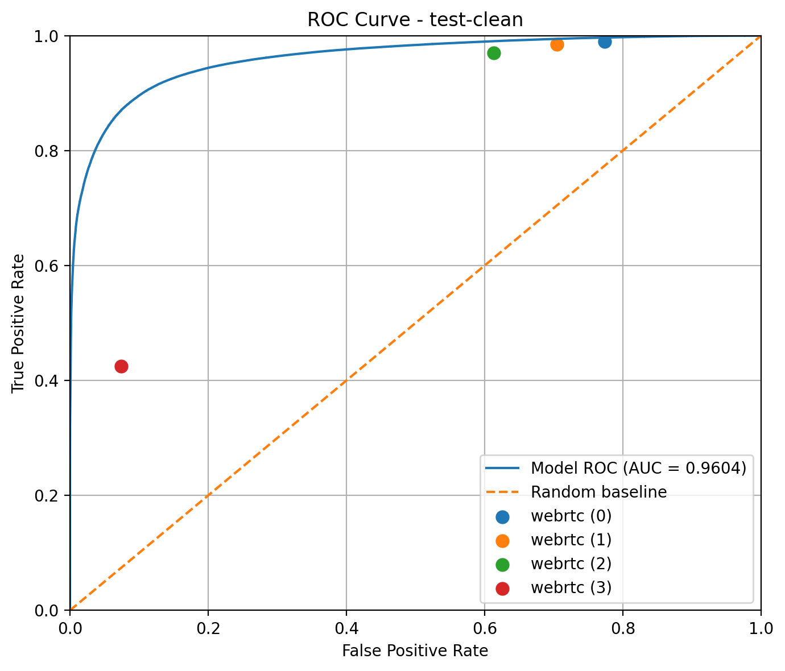

Evaluation
==========

Evaluation Protocol
-------------------

The model is evaluated as a **frame-level binary classifier**.

For each audio sample:

1. Run inference to obtain frame-level **speech probabilities** and **binary predictions**
2. Align ground-truth labels to the model’s frame resolution
3. Compare predictions and targets at the frame level

Small alignment mismatches (±1–2 frames) are automatically trimmed.

Metrics are **aggregated globally across all frames**, meaning longer audio files
contribute proportionally more to the final score.

Metrics
-------

Threshold-based metrics
~~~~~~~~~~~~~~~~~~~~~~~

Using a fixed decision threshold (default: ``0.5``), the following metrics are computed:

- **Precision**: proportion of predicted speech frames that are correct
- **Recall (TPR)**: proportion of true speech frames detected
- **F1-score**: harmonic mean of precision and recall
- **Accuracy**: overall frame-level correctness
- **False Positive Rate (FPR)**: proportion of non-speech frames incorrectly classified as speech
- **False Negative Rate (FNR)**: proportion of speech frames missed

ROC curve and AUC
~~~~~~~~~~~~~~~~~

In addition to fixed-threshold metrics, the model is evaluated using a
**Receiver Operating Characteristic (ROC) curve**.

- The model outputs **continuous speech probabilities** for each frame
- The decision threshold is swept across all possible values
- For each threshold, the **True Positive Rate (Recall)** and **False Positive Rate** are computed

This produces a ROC curve summarizing the model’s performance across all operating points.

The **Area Under the Curve (AUC)** is reported:

- ``AUC = 1.0`` → perfect separation
- ``AUC = 0.5`` → random performance

This metric is **threshold-independent** and reflects the model’s ranking quality.

   Example ROC curve for the trained VAD model. The curve shows the
   threshold sweep of the neural model, while markers indicate discrete
   operating points corresponding to WebRTC aggressiveness modes.

Decision Threshold
------------------

The model outputs probabilities in ``[0, 1]``.

- A threshold (default: ``0.5``) is applied to obtain binary predictions
- Lower threshold → higher recall, more false positives
- Higher threshold → higher precision, more missed speech

The ROC curve provides a principled way to **select an operating point**
depending on application constraints.

Baseline Comparison
-------------------

We compare our model against established baselines (see :ref:`baselines`).

Evaluation is performed under identical conditions:

- Same dataset and splits
- Same frame resolution
- Same label alignment procedure

Operating point interpretation
~~~~~~~~~~~~~~~~~~~~~~~~~~~~~~

Unlike the neural model, some baselines (e.g., WebRTC VAD) do not produce
continuous scores.

Instead:

- Each configuration (e.g., aggressiveness level) corresponds to a **single operating point**
- These points are plotted on the model’s ROC curve

This allows direct comparison in **FPR–TPR space**, making trade-offs between
systems easy to interpret.

Example command
---------------

Basic comparison:

.. code-block:: bash

   vad-compare-models \
       --checkpoint checkpoints/best_causal_vad.pt \
       --results-root data/Results \
       --labels-root data/Labels \
       --split dev-clean

With ROC curve and all baseline configurations:

.. code-block:: bash

   vad-compare-models \
       --checkpoint checkpoints/best_causal_vad.pt \
       --split dev-clean \
       --all-webrtc \
       --roc-output outputs/roc.png

What to look at
---------------

- **AUC score**: overall model quality (threshold-independent)
- **ROC curve shape**: trade-off between false positives and recall
- **Operating point**: where the chosen threshold lies on the curve
- **Comparison to baselines**:
  - Does the model achieve higher recall at the same FPR?
  - Does it reduce false positives at similar recall?

Also consider:

- F1-score at the default threshold
- Behavior under noisy conditions
- Stability of predictions over time

Limitations
-----------

- Evaluation is **frame-level only** (no segment-level metrics)
- Baselines without probabilistic outputs yield only **discrete operating points**
- No statistical significance analysis
- ROC does not capture temporal consistency (e.g., jitter)

Possible Improvements
---------------------

- Plot **Precision–Recall (PR) curves** (more informative for imbalanced data)
- Evaluate **segment-level metrics** (onset/offset accuracy)
- Perform **threshold tuning on validation data**
- Analyze performance across **noise conditions or domains**
- Measure **latency and streaming performance**

Qualitative Evaluation
----------------------

Predictions can be visualized alongside:

- waveform
- ground-truth labels
- model probabilities

This helps identify:

- Missed speech segments
- False positives in noise
- Temporal jitter or instability

Visualization is available via:

.. code-block:: bash

   vad-infer-offline --audio example.wav --show-plot

Key takeaway
------------

The evaluation combines:

- **Threshold-dependent metrics** (practical performance)
- **ROC/AUC analysis** (intrinsic model quality)
- **Baseline operating points** (real-world comparison)

This provides a **rigorous and interpretable evaluation framework**
for Voice Activity Detection.
